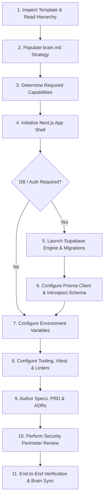

# Project Instantiation & Setup Protocol (`SETUP.md`)

> **Audience**: AI coding agents and developers creating a new project from this template.  
> **Rule**: Adhere to this exact ordered sequence to ensure structural integrity, prevent schema collisions, and avoid accidental complexity.

---

## Operating Philosophy: Scale Up, Not Bloat Down
This template provides enterprise-ready baselines (Next.js, Prisma, Supabase, TypeScript), but **not all projects require all layers**:
- **Simple Public Websites / Content / Tools**: Skip database, auth, and backend mutations. Do not install Prisma or launch Supabase. Unused layers remain dormant without overhead.
- **Full Applications / SaaS Products**: Activate the complete stack adhering strictly to the Prisma/Supabase boundary and defense-in-depth security model.

---

## Ordered Step-by-Step Instantiation Protocol



---

### Step 1: Inspect Template & Read Foundation Documents
Before running commands or modifying files:
1. Read [`project_constitution.md`](project_constitution.md) — understand the Document Precedence Hierarchy, Next.js conventions, Article VI (Migration Pipeline), and the AI Session Protocol.
2. Read [`architecture/tooling-conventions.md`](architecture/tooling-conventions.md) — observe path aliasing (`@/*`), Vitest default, and testing import rules.
3. Read [`architecture/database-migration-boundary.md`](architecture/database-migration-boundary.md) — understand the single Supabase SQL migration pipeline and Prisma introspection boundary.
4. Read root [`README.md`](README.md) — review the directory tree and pillar locations.

---

### Step 2: Populate `brain.md` with Project-Specific Information
`brain.md` is the canonical persistent source of truth. Populate the baseline:
1. **Update Project Metadata**: Set `Last Updated` to today's date, `Updated By` to your agent/developer name, and `Current Phase` to `Discovery` or `Prototyping`.
2. **Fill Core Strategy**: Complete Section 1 (*Product Identity*), Section 2 (*Problem Statement*), Section 3 (*Target Users*), Section 4 (*User Needs*), and Section 5 (*Value Proposition*).
3. **Define Scope & Constraints**: Complete Section 6 (*Product Goals*), Section 7 (*Non-Goals*), Section 9 (*Brand & Design*), and Section 11 (*Important Constraints*).
4. **Declare Stack Decisions**: In Section 15 (*Key Technical Assumptions*), explicitly answer:
   - `Database Required`: `[Yes / No]`
   - `Authentication Required`: `[Yes / No]`
   - `Rendering Strategy`: `[Server Components + SSR default / Static Export (SSG) / Client-Heavy]`
   - `Styling Choice`: `[Tailwind CSS / CSS Modules]`
5. **Record Project Tier**: Add `Project Tier: T[N] — [Description]` to `brain.md` §0 (T1 Static Marketing · T2 Content / Editorial · T3 Public Interactive Tool · T4 E-Commerce Storefront · T5 Internal / Team App · T6 SaaS Platform). Later steps that reference T1–T6 (e.g. Playwright provisioning, PRD scope, security review depth) resolve against this taxonomy.

---

### Step 3: Determine Required Capabilities & Scope
Based on `brain.md` Section 14 and Section 15, classify the active capabilities:

| Capability | Simple Website / Public Tool | Full SaaS / App | Activation Action |
| :--- | :--- | :--- | :--- |
| **Relational Database** | Inactive | **Active** | Migrations in Supabase (Step 5), Prisma client in Step 6 |
| **Authentication** | Inactive | **Active** | Activated via Supabase Auth in Step 5 |
| **File Storage** | Inactive (use static) | **Active** | Activated via Supabase Storage in Step 5 |
| **Local Supabase Engine** | Dormant | **Active** | Launched via `supabase start` in Step 5 |
| **Payments / Billing** | Inactive | Optional | Configured in `src/server/integrations/` |

> [!IMPORTANT]
> If a capability is **Inactive**, leave its template directory dormant. Never force dependencies, migrations, or route guards for unused capabilities.

---

### Step 4: Initialize Next.js Application Without Destroying Scaffold
Install and configure Next.js without clobbering existing directories (`src/`, `public/`, documentation):
1. **Initialize `package.json`**:
   ```bash
   npm init -y
   ```
2. **Install Core Next.js & React Dependencies**:
   ```bash
   npm install next@latest react@latest react-dom@latest
   npm install -D typescript @types/node @types/react @types/react-dom
   ```
3. **Configure `tsconfig.json`**:
   Ensure compiler options match [`architecture/tooling-conventions.md`](architecture/tooling-conventions.md):
   ```json
   {
     "compilerOptions": {
       "target": "ES2022",
       "lib": ["dom", "dom.iterable", "esnext"],
       "allowJs": true,
       "skipLibCheck": true,
       "strict": true,
       "noEmit": true,
       "esModuleInterop": true,
       "module": "esnext",
       "moduleResolution": "bundler",
       "resolveJsonModule": true,
       "isolatedModules": true,
       "jsx": "preserve",
       "incremental": true,
       "plugins": [{ "name": "next" }],
       "baseUrl": ".",
       "paths": {
         "@/*": ["./src/*"]
       }
     },
     "include": ["next-env.d.ts", "**/*.ts", "**/*.tsx", ".next/types/**/*.ts"],
     "exclude": ["node_modules"]
   }
   ```
4. **Create `next.config.ts`** at the project root with standard security headers.

---

### Step 5: Configure Supabase Local Engine & Migrations *(Optional — DB/Auth Projects Only)*
*Skip this step if `brain.md` marks Database and Authentication as Inactive.*

Supabase SQL is the **single source of truth** for all database migrations.
1. **Verify Configuration**: Inspect [`supabase/config.toml`](supabase/config.toml). Local direct database runs on port `54322` by default.
2. **Author Initial Migration(s)**:
   Create migration files in `supabase/migrations/` using timestamp prefixes.
   ```bash
   npx supabase migration new initial_schema
   ```
   **Migration Ordering Rules**:
   - *Extensions First*: `CREATE EXTENSION IF NOT EXISTS "uuid-ossp";` or `"vector"` must execute before any tables use them.
   - *Tables & Constraints Second*: Create tables, columns, indexes, and enums.
   - *RLS & Triggers Third*: `ALTER TABLE ... ENABLE ROW LEVEL SECURITY;`, `CREATE POLICY ...`, and triggers referencing the newly created tables.
   - Timestamps determine execution order.
3. **Start Local Docker Engine & Apply Migrations**:
   ```bash
   npx supabase start
   ```
   *Starts local PostgreSQL, Auth, Inbucket (email), and Storage in Docker, automatically applying all `supabase/migrations/*.sql`.*
4. **Record Output Credentials**: Note the local `API URL`, `anon key`, `service_role key`, and `DB URL` printed by the CLI for Step 7.

---

### Step 6: Configure Prisma Client & Introspect Schema *(Optional — Relational DB Projects Only)*
*Skip this step if `brain.md` marks Database as Inactive.*

Prisma is used strictly as an ORM and type-safe query client. **Prisma never runs migrations** — per [`project_constitution.md`](project_constitution.md) §"Database Migrations", never run `prisma migrate dev`, `prisma migrate deploy` or `prisma migrate reset`. Supabase SQL migrations in `supabase/migrations/` are the only schema authority; Prisma is a derived layer, and `prisma/migrations/` must not exist.

> This step is already complete for this repository. The shape is recorded here because the Prisma 7 configuration differs from older guides.

1. **Install Prisma 7, the pg driver adapter and the runtime driver**:
   ```bash
   npm install @prisma/client @prisma/adapter-pg pg server-only
   npm install -D prisma dotenv
   ```
2. **Connection URLs live in `prisma7.config.ts`, not in the schema.** Prisma 7 removed both `url` and `directUrl` from `datasource` blocks — keeping `directUrl` fails validation with `P1012: The datasource property 'directUrl' is no longer supported in schema files`.
   ```prisma
   // prisma/schema.prisma — models are produced by introspection, never hand-written
   generator client {
     provider        = "prisma-client"
     output          = "../src/generated/prisma"
     previewFeatures = ["partialIndexes"]
   }

   datasource db {
     provider = "postgresql"
   }
   ```
   ```ts
   // prisma7.config.ts — the filename Prisma 7.10 generates;
   // `prisma.config.ts` is the legacy candidate it also accepts.
   import "dotenv/config";
   import { defineConfig } from "prisma/config";

   export default defineConfig({
     schema: "prisma/schema.prisma",
     datasource: { url: process.env["DIRECT_URL"] ?? process.env["DATABASE_URL"] },
   });
   ```
3. **Introspect the live database** (reads only):
   ```bash
   npm run db:pull      # prisma db pull — rewrites prisma/schema.prisma
   ```
   `prisma/schema.prisma` is 100% generated: `db pull` replaces the whole file and drops any hand-written comment, so keep derivation notes here and in `prisma7.config.ts`, and never hand-edit models. That is also what makes the CI drift check in the operational table below meaningful.
4. **Generate the typed client** (needs no credentials, so it is CI-safe):
   ```bash
   npm run db:generate  # prisma generate → src/generated/prisma
   ```
   Because `src/generated/prisma` is gitignored, `npm install` regenerates it automatically through the `postinstall` script. `npm run db:sync` runs pull + generate together, and `npm run db:validate` checks the schema.
5. **Server-side access** goes through `src/lib/prisma/db.ts` → `getPrisma()`. That module is marked `server-only` and authenticates as a privileged role that **bypasses catalogue RLS**, so the public visibility rules (`is_active` on the row *and* on its parent collection) must be re-applied in every public query. The storefront does this in one place: `src/lib/catalogue-server.ts` (`getStorefrontCatalogue`), which every catalogue route reads through.

6. **Seed the verified catalogue**:
   ```bash
   npm run db:seed:remote   # npx supabase db query --linked -f supabase/seed.sql
   ```
   `supabase/seed.sql` holds the real catalogue content. Every statement upserts on `slug`, so re-running updates rows in place instead of duplicating them. It deliberately never writes prices (`price_minor` / `currency` stay NULL) and never writes `product_images` — the project has no image files or Storage bucket, so inserting rows would mean inventing image metadata.

---

### Operational Reference: Database Scenarios

| Scenario | Prescribed Command Sequence |
| :--- | :--- |
| **Fresh local project** | 1. `npx supabase start` *(applies `supabase/seed.sql`)*<br>2. `npm run db:sync` |
| **Seed catalogue data (remote)** | `npm run db:seed:remote` *(runs `npx supabase db query --linked -f supabase/seed.sql` — repeatable upsert on `slug`)* |
| **Orphaned reference cleanup** | Use the documented query at the end of `supabase/migrations/20261004130722_custom_orders.sql`: remove unlinked `custom_order_attachments` (and their Storage objects, with the secret key) once an upload window is clearly abandoned. |
| **Normal schema change** | 1. `npx supabase migration new <name>`<br>2. Edit `supabase/migrations/<ts>_<name>.sql`<br>3. `npx supabase migration up`<br>4. `npm run db:sync` *(runs `prisma db pull && prisma generate`)* |
| **Full local reset** | 1. `npx supabase db reset` *(local Supabase stack only; requires Docker)*<br>2. `npm run db:sync` |
| **Remote deployment** | 1. `npx supabase db push`<br>2. `npx prisma generate` *(in CI/build step)*<br>3. Deploy Next.js |
| **Continuous Integration (CI)** | 1. `npx supabase start`<br>2. `npx prisma db pull && git diff --exit-code prisma/schema.prisma`<br>3. `npx prisma generate`<br>4. `npx vitest run`<br>5. `npx supabase stop` |

---

### Step 7: Configure Environment Variables
1. **Copy Template to Local Environment**:
   ```bash
   cp .env.example .env
   ```
   Use `.env` (not only `.env.local`): Next.js loads both, but the Prisma CLI loads `.env` through `prisma7.config.ts`.
2. **Populate Secrets**:
   - For public websites: Set `NEXT_PUBLIC_APP_URL="http://localhost:3000"`.
   - For database/auth projects: fill the two database URLs, which are deliberately different connections:
     - `DIRECT_URL` — Supabase Supavisor **session** pooler, port **5432**. Used only by the Prisma CLI for introspection.
     - `DATABASE_URL` — Supabase Supavisor **transaction** pooler, port **6543**. Used by the app at runtime; the transaction mode suits Vercel's short-lived serverless functions.
     - `DATABASE_URL` must include `uselibpqcompat=true`. Supabase's pooler serves a certificate from a private CA, and pg 8.23+ treats `sslmode=require` as `verify-full`, so a plain `sslmode=require` fails with *"self-signed certificate in certificate chain"*. See `.env.example` for the full explanation, including why the legacy `pgbouncer=true` flag must **not** be used with Prisma 7.
     - Custom-order reference images need two server-only variables: `SUPABASE_URL` and `SUPABASE_SECRET_KEY` (the current-format `sb_secret_...` key). They are used only by `src/lib/supabase/admin.ts` to mint short-lived signed upload/download URLs for the private `custom-order-references` bucket. The key is privileged — it bypasses Storage RLS and the table grants that keep submissions private — so it must never be exposed to the browser. See the comment block in `.env.example`.
     - `NEXT_PUBLIC_SUPABASE_URL`, `NEXT_PUBLIC_SUPABASE_ANON_KEY` and Auth variables are still not required: customers do not have accounts, and no key of any kind is shipped to the browser (upload URLs are signed server-side).
   - *Note*: Do not set `NODE_ENV` in environment files — Next.js sets it automatically. Use `APP_ENV` for custom environment names.
3. **Rule**: Never commit `.env` / `.env.local` to Git. Verify `.gitignore` rules (only `.env.example` is committable).

---

### Step 8: Configure Tooling & Testing Infrastructure
1. **Install Vitest and Testing Utilities**:
   ```bash
   npm install -D vitest
   # For projects with component/browser-adjacent tests (T3–T6), also:
   npm install -D @vitejs/plugin-react jsdom
   ```
2. **Create `vitest.config.ts`** at the project root with the `@/*` path alias mapped to `./src` as defined in [`architecture/tooling-conventions.md`](architecture/tooling-conventions.md).
3. **End-to-End Testing (T4–T6 or projects with critical multi-step flows)**:
   ```bash
   npm install -D @playwright/test
   ```
   Create `playwright.config.ts` pointing `testDir` at `testing/e2e/`. Install browser binaries once with `npx playwright install` (and `npx playwright install --with-deps` on CI images). Lightweight T1–T3 projects skip Playwright — E2E testing is not provisioned for projects that genuinely do not need it.
4. **Install Code Quality Tooling**:
   ```bash
   npm install -D prettier eslint eslint-config-next
   ```
   Add root `.prettierrc` and `eslint.config.mjs`.
   The canonical lint script is `"lint": "eslint ."` (Next.js 16 removed `next lint`).

---

### Step 9: Author Architecture Specifications & PRDs
1. **Synchronize Product Vision**: Fill [`product/vision.md`](product/vision.md) with concise summaries extracted from `brain.md`.
2. **Draft MVP PRD** *(T3–T6 projects)*: Create `specifications/prds/001-mvp.md` detailing user stories, acceptance criteria, and API requirements for the initial release. For T1–T2 lightweight sites, record MVP scope directly in `brain.md` §12 (*Current Project State*) instead.
3. **Record Architectural Decisions**: If any default technology was overridden (e.g. choosing Jest over Vitest, or CSS Modules over Tailwind), record an ADR in `decisions/records/` using `decisions/templates/adr-template.md`.

---

### Step 10: Perform Initial Security Review
1. **Secret Isolation**: Confirm that `SUPABASE_SERVICE_ROLE_KEY` and database passwords appear strictly in server-side files and never leak to `NEXT_PUBLIC_` variables.
2. **Database Perimeter**: If a database is active, verify that every table has Row-Level Security enabled.
3. **HTTP Security Headers**: Verify CSP, HSTS, and frame protection in `next.config.ts` or `src/proxy.ts`.
4. **Input Boundary**: Verify that Zod is set up for validating all incoming request payloads.
5. **Skill-Based Audits**: For T4–T6 projects, delegate this review to the `vibe-security` skill (full audit scoped to `brain.md` §0 tier + §14 active integrations). Before any first production deployment, run the full `vibe-security` audit again as a release gate.

---

### Step 11: End-to-End Verification Before Completion
Before declaring setup complete, verify:
- [ ] TypeScript compiles cleanly: `npx tsc --noEmit`
- [ ] Linter passes: `npm run lint`
- [ ] Test suite executes: `npx vitest run`
- [ ] Next.js development server runs: `npm run dev` (verify root layout renders)
- [ ] `brain.md` Section 12 (*Current Project State*) is updated to reflect that project initialization is complete and active development has begun.
- [ ] `brain.md` Project Metadata header is updated (`Current Phase: Prototyping` or `MVP Development`).

## Admin access (studio owner only)

The admin area is for the owner; there are no customer accounts and no public
sign-up route exists in the app.

1. **Create the account.** Supabase Dashboard → Authentication → Users →
   *Add user*. Enter the owner's email and a password, and confirm the user.
   (Nothing in the app can create an account — by design.)
2. **Allowlist it.** Set `ADMIN_EMAILS` to that email in the server environment
   (locally in `.env`, and in Vercel for the deployment). Optionally also set
   `ADMIN_USER_IDS`. An authenticated user who is not on this list is treated as
   an ordinary visitor and is redirected away from `/admin`.
3. **Publishable key.** Ensure `NEXT_PUBLIC_SUPABASE_URL` and
   `NEXT_PUBLIC_SUPABASE_PUBLISHABLE_KEY` are set (the project's publishable/anon
   key — public by design). The privileged `SUPABASE_SECRET_KEY` must never be
   exposed with a `NEXT_PUBLIC_` name.
4. Restart/redeploy, then sign in at `/admin/login`.

Authorisation is enforced server-side in three independent places: `src/proxy.ts`
gates the whole `/admin` segment, every admin page calls `requireAdmin()`, and
every admin Server Action re-checks the allowlist before touching data or minting
a Storage upload URL.

Catalogue images use the public `product-images` bucket. Uploads are only
possible through short-lived signed URLs minted by an admin-only action, object
paths are generated server-side (`products/<productId>/<uuid>.<ext>` and
`collections/<collectionId>/<uuid>.<ext>`), and no anon/authenticated Storage
policy exists — so the bucket is readable by the storefront and writable only by
the studio.
